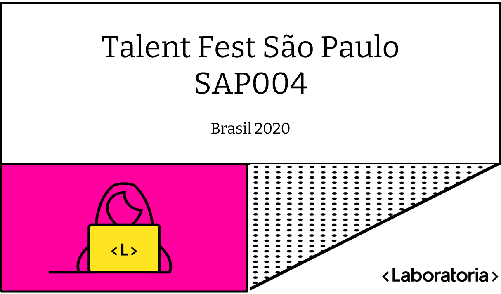

# Laboratória - 4ª Geração :two_hearts: 


Projeto desenvolvido na Laboratória nos dias 08 á 11 de Setembro.
<br>

### Link para a aplicação: https://women-force-f7eaf.web.app/

<br>

## Índice

****

* [1. Desafio](#1-desafio)
* [2. Montagem do ambiente](#2-montagem-do-ambiente)
* [3. Solução](#3-solucao)
* [4. Prototipação](#4-prototipacao)

<br>

## 1. Desafio CI&T
****
Construir um MVP de um Produto Digital para engajar as mulheres na tecnologia. 

</br>

<p align="center">
 
</p>

</br>

## Desejável:
****
* Código disponível no GitHub ou no GitLab
* Acessibilidade
* Mobile First
* Responsivo
* Linguagem inclusiva

</br>

## 2. Montagem do Ambiente
****
Neste projeto foi utilizado **ReactJS**, **Firebase**, **ReactBootstrap**.

</br>

## 3. Solução
****
Realizamos uma plataforma destinada a ajudar as mulheres a identificarem empresas na área de tecnologia que possuam ambiente inclusivo e seguro.

</br>

## 4. Prototipação
****


O protótipo foi realizado pelo Figma. 

</br>


</br>

### :warning: Pré-Requisitos:
****

1. Node.js e NPM instalado

</br>

### 🚀 Rodando o projeto localmente

****

</br>

1. Clone o projeto na sua máquina

```sh
git clone https://github.com/EvellynThamires/Women-Force.git
```

2. Acesse a pasta do projeto
 
```sh
cd Women-Force
```

3. Instale todas as dependências do projeto

```sh
npm install
```

4. Rode o projeto na sua máquina

```sh
npm start
```

5. Abra o navegador e visualize o projeto

```sh
http://localhost:3000
```

---------------------------------------------------

Desenvolvido por **Evellyn Uyemura**, **Jessica Brunhara**, **Jucilene Barros**, **Milena Ferraz**.
