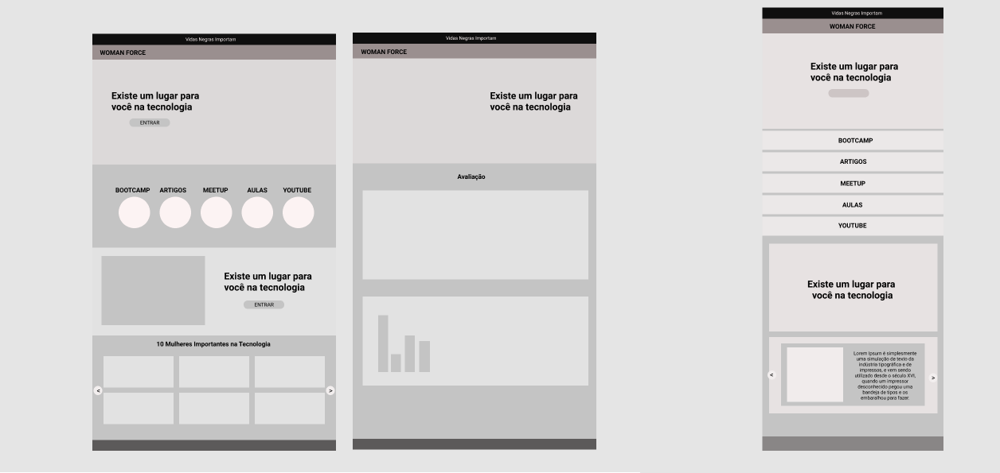

## Talent Fest CI&T Challenge
Projeto desenvolvido na Laboratória nos dias 08 á 11 de Setembro.
 
Link para a aplicação: https://women-force-f7eaf.web.app/

 

 

 

## Índice

* [1. Desafio](#1-desafio)
* [2. Montagem do ambiente](#2-montagem-do-ambiente)
* [3. Solução](#3-solucao)
* [4. Prototipação](#4-prototipacao)

 

## 1. Desafio CI&T
Construir um MVP de um Produto Digital para engajar as mulheres na tecnologia. 
 
### Desejável:
* Código disponível no GitHub ou no GitLab
* Acessibilidade
* Mobile First
* Responsivo
* Linguagem inclusiva

## 2. Montagem do Ambiente
A linguagem neste projeto foi deixada á nossa escolha, assim decidimos utilizar ReactJS, Firebase, ReactBootstrap.

## 3. Solução
Realizamos uma plataforma destinada a ajudar as mulheres a identificarem empresas na área de tecnologia que possuam ambiente inclusivo e seguro.

## 4. Prototipação
O protótipo foi realizado pelo Figma. 

 

Desenvolvido por Evellyn Uyemura, Jessica Brunhara, Jucilene Barros, Milena Ferraz.
